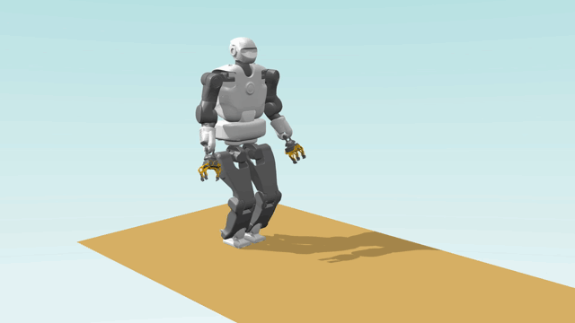
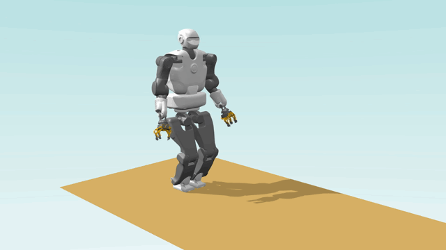

This folder contains several serialized ContactSequence objects for different scenarios. They are all made for the Talos humanoid robot, and a simple environment with a flat floor at z=0.

All this file have been generated with the [multicontact-locomotion-planning](https://github.com/loco-3d/multicontact-locomotion-planning) framework.

## Loading the files:

### C++

```c
#include "multicontact-api/scenario/contact-sequence.hpp"


ContactSequence cs;
cs.loadFromBinary(filename);
```

### Python


```python
from multicontact_api import ContactSequence

cs = ContactSequence()
cs.loadFromBinary(filename)
```

## Display the motion in gepetto-gui

A script is provided to load a motion and display it in gepetto-gui, this script require pinocchio (with python bindings) and gepetto-gui. 

```
python3 display_gepetto_gui.py CS_WB_NAME
```

Optionally, you can specify an environment to load in the viewer (the default is a flat floor at z=0)

```
python3 display_gepetto_gui.py CS_WB_NAME --env_name  multicontact/plateforme_surfaces
```

## Suffix notation

For the same scenario, several files may exist with different Suffixes, here is the meaning of this Suffixes:

* No Suffix: only contains the contacts placements, the initial and final CoM position and the initial and final wholeBody configuration. 
* _COM Suffix: also contains the phases duration and the centroidal trajectories (c, dc, ddc, L, dL)
* _REF Suffix: also contains the end-effector trajectories for each swing phases
* _WB Suffix: also contains all the WholeBody data (q, dq, ddq, tau, contact forces). 
Note that the centroidal and end-effector trajectories contained in this file are not exactly the same as the ones in the _REF file, they are computed from the wholeBody motion.

## Scenarios

### com_motion_above_feet

Contact sequence with only one Contact Phase:

Starting from the reference configuration with both feet in contacts, the CoM is moved above the right feet (in 2 seconds) then above the left feet (in 3 seconds), then go back to the reference position (in 2 seconds).




### step_in_place_quasistatic

Starting from the reference configuration with both feet in contact with the ground, the Robot do 2 steps in place with each feet (starting with the right one). 
The Centroidal motion is quasi-static : the CoM only move during the double support phase (duration 2s) and is fixed during the single support phase (duration 1.5s).


### step_in_place

Similar to above exept that the motion is not quasi-static and the double support duration is 0.2 seconds and the single support last 1 seconds.



### walk_20cm

Walk 1 meter forward with 20cm steps, starting with the right foot. The first and last steps are only 10cm long. Double support duration 0.2seconds, single support duration 1.2seconds.


### walk_20cm_quasistatic

Similar to above exept that the motion is quasistatic and the CoM only move during the double support phases. Double support duration 2 seconds, single support duration 2 seconds.


